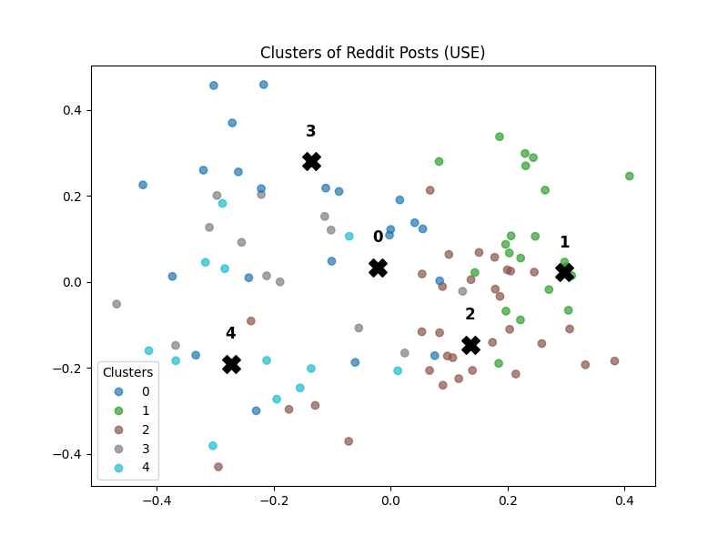

# Reddit Data Collection System - DSCI 560 Lab 5

A complete Reddit scraper that fetches posts from r/tech, extracts keywords and topics, handles image OCR, and stores data in MySQL database.

## Features

- **Reddit API Integration**: Fetches posts from r/tech subreddit
- **Data Processing**: Text preprocessing, username masking, domain extraction
- **Keyword Extraction**: TF-IDF based keyword extraction with fallback
- **Topic Classification**: AI/ML, Hardware, Software, Mobile, Health, Biology, Security using spaCy NLP
- **Image OCR**: Extracts text from images using pytesseract
- **Database Storage**: MySQL database with optimized schema
- **Periodic Scraping**: Automated data collection at specified intervals

## Database Schema

```sql
posts (
    id VARCHAR(20) PRIMARY KEY,
    title TEXT NOT NULL,
    author VARCHAR(255),
    created_utc DATETIME,
    score INT,
    num_comments INT,
    upvote_ratio DECIMAL(3,2),
    url TEXT,
    domain VARCHAR(255),
    keywords TEXT,
    topics TEXT,
    image_text TEXT
)
```

## Setup

1. **Install Dependencies**
   ```bash
   pip install -r requirements.txt
   ```

2. **Install spaCy Model**
   ```bash
   python -m spacy download en_core_web_sm
   ```

3. **Configure Reddit API**
   - Create Reddit app at https://www.reddit.com/prefs/apps
   - Update `config.py` with your credentials

4. **Setup Database**
   ```bash
   python setup_database.py
   ```

## Usage

### One-time Scraping
```bash
python reddit_scraper.py <number_of_posts>
```
Example: `python reddit_scraper.py 100`

### Periodic Scraping
```bash
python main.py <interval_in_minutes>
```
Examples:
- `python main.py 5` - Every 5 minutes
- `python main.py 30` - Every 30 minutes
- `python main.py 60` - Every hour

Press Ctrl+C to stop periodic scraping.

## Files

- `reddit_scraper.py` - Main scraper with TF-IDF keywords and spaCy topic classification
- `main.py` - Periodic scraper for automated collection
- `config.py` - API credentials and database settings
- `database_setup.sql` - MySQL schema
- `setup_database.py` - Database initialization
- `requirements.txt` - Python dependencies

## Data Processing

- **Keywords**: TF-IDF extraction from title + image text with enhanced filtering
- **Topics**: 7 categories (AI/ML, Hardware, Software, Mobile, Health, Biology, Security) using spaCy entity recognition
- **Privacy**: Usernames masked as `user_XXXX` format
- **Domain**: Source domain extracted (youtube.com, github.com, self.tech)
- **Images**: OCR text extraction from imgur, i.redd.it using pytesseract

## Example Queries

```sql
-- Posts by domain
SELECT domain, COUNT(*) FROM posts GROUP BY domain;

-- High-scoring posts
SELECT title, score, keywords FROM posts WHERE score > 100;

-- Posts by topic
SELECT * FROM posts WHERE topics LIKE '%AI%';
```

## Embedding & Clustering

- **Embedding**: Universal Sentence Encoder (USE, 512-dim)
    - USE provides high-quality, ready-to-use semantic embeddings
    - USE captures sentence/document similarity more effectively
- **Clustering**: KMeans algorithm with configurable `k` (default: 5)
- **Keywords per Cluster**: Extracted using TF-IDF
- **Verification**: Each cluster shows representative posts and sample messages
- **Visualization**: PCA scatter plot of posts with clusters, centroids marked by `X` and cluster IDs
- **Model Saving**: Clustering results (KMeans, embeddings, texts) saved in `models/cluster_model.pkl` for user interaction
- 
### Why Universal Sentence Encoder (USE)?

- **Compatibility and Stability**  
  Doc2Vec (Gensim) is not fully supported in Python 3.13, while USE is actively maintained by Google TensorFlow Hub. USE provides a ready-to-use API with no training required, making it robust for academic projects.

- **Semantic Understanding**  
  Doc2Vec learns embeddings mainly from local context in the training corpus, which may be limited if the dataset is small. USE is pre-trained on a large and diverse dataset (Wikipedia, news, Q&A sites, etc.), allowing it to capture general semantic meaning and sentence-level similarity out of the box.

- **High-Dimensional Rich Embeddings**  
  USE provides 512-dimensional embeddings optimized for semantic similarity tasks (clustering, retrieval, classification). Doc2Vec embeddings are often lower-dimensional and require more fine-tuning to achieve comparable results.

- **Performance on Downstream Tasks**  
  Benchmarks consistently show that USE outperforms Doc2Vec in clustering and classification tasks where semantic similarity matters. This makes it particularly effective for grouping Reddit posts based on meaning rather than just keyword overlap.

- **Ease of Integration**  
  USE can be loaded directly from TensorFlow Hub with a single line of code, and requires no additional training. This saves both time and computational resources.

## Usage
```bash
python clusters_use.py
```

## Expected Output
### Representative Posts
```bash
Cluster 0 representative: Scientists develop battery that converts nuclear energy into electricity via light emission
...
```

### Cluster Keywords
```bash
Cluster Keywords:
Cluster 0 keywords: battery, new, energy, power, ev
...
```

### Cluster Verification (sample)
```bash
Cluster 0 (28 posts) keywords: battery, new, energy, power, ev
- Scientists develop battery that converts nuclear energy into electricity via light emission
  ...
```

## Visualization
- The 2D PCA scatter plot of clustered posts is automatically saved as **`clusters_use.png`**  
- In the plot:  
  - **Colors** represent different clusters  
  - **Black X** marks the centroids  
  - **Numbers** indicate cluster IDs  

Example:  

